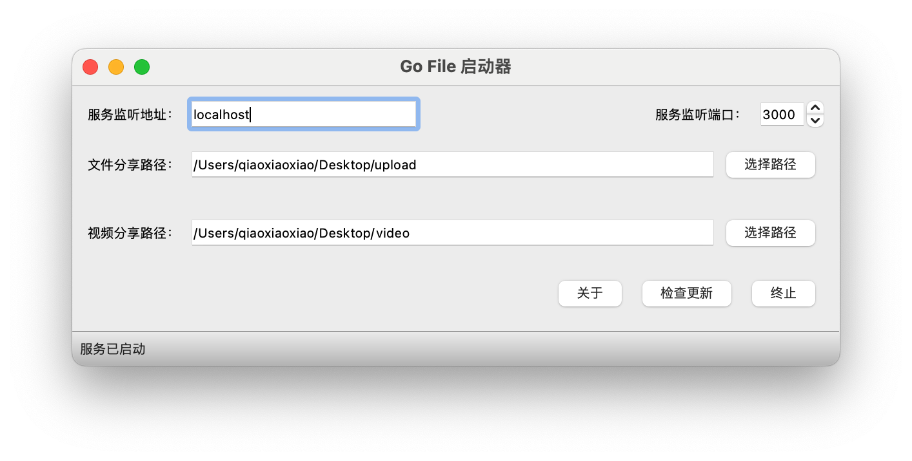

# Go File 启动器
> 为 [Go File](https://github.com/songquanpeng/go-file) 制作的启动器，方便不想或不会使用终端的用户

<p>
  <a href="https://raw.githubusercontent.com/songquanpeng/gofile-launcher/main/LICENSE">
    
  </a>
  <a href="https://github.com/songquanpeng/gofile-launcher/releases/latest">
    
  </a>
  <a href="https://github.com/songquanpeng/gofile-launcher/releases/latest">
    
  </a>
</p>

请前往 [Release 页面](https://github.com/songquanpeng/gofile-lancher/releases/latest)下载最新版本。


## 截图展示




## 使用

### Windows 用户  
直接双击 gofile-launcher.exe 运行  

### macOS 用户
1. 给执行权限：`chmod u+x gofile-launcher-macos`
2. 之后直接双击运行 gofile-launcher-macos 或在终端中运行都可  

## 打包流程
```bash
pip install -r requirements.txt
pyuic5 -o ui.py main.ui
pyrcc5 -o resource.py resouce.qrc 
pyinstaller --noconsole -F ./main.py --icon icon.png -n gofile-launcher.exe
```
